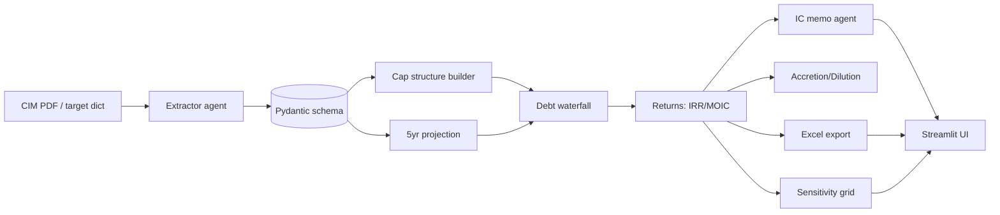

<p align="center">
  
</p>

<p align="center">
  <a href="https://github.com/sheharyarmonnoo/m-and-a-underwriter/actions/workflows/ci.yml"></a>
  <a href="LICENSE"></a>
  
  <a href="https://p-portfolio-sigma.vercel.app"></a>
</p>

<h1 align="center">M&A Underwriter ⭐ **Flagship**</h1>

<p align="center"><strong>CIM PDF → LBO model + IC memo. Full debt cascade, accretion/dilution, IRR/MOIC.</strong></p>

<p align="center">
  <code>finance-ai-labs</code> &middot; <code>M&A · LBO · IC memo</code>
</p>

---

## The problem

> Underwriting a sponsor LBO still means hand-keying the same Sources & Uses, the same debt schedule, the same returns sensitivity — on every target.
> The variance is in the assumptions, not the mechanics. So the mechanics are exactly what an agent should own.

## What it does

- CIM-style PDF → pydantic-validated target financials (revenue, EBITDA, NWC, capex, debt)
- Capital structure builder: revolver, TLA, TLB, mezz, PIK with maturities, coupons, amort
- 5-year LBO projection with debt paydown waterfall
- Exit at multiple → IRR / MOIC
- 5×5 sensitivity grid: entry multiple × exit multiple
- Accretion / dilution: stand-alone vs. pro-forma EPS
- Agentic 2-page IC memo authored against the extracted numbers
- openpyxl workbook export with all schedules
- Streamlit UI: upload PDF, see model + memo

## Architecture



## Quickstart

```bash
git clone https://github.com/sheharyarmonnoo/m-and-a-underwriter.git
cd m-and-a-underwriter && pip install -e ".[dev]"
cp .env.example .env  # fill in OPENAI_API_KEY
python -m m_and_a_underwriter examples/target_acme.json
streamlit run src/m_and_a_underwriter/app.py
```

Set your LLM key in `.env`:

```bash
cp .env.example .env
# OPENAI_API_KEY=sk-...    (or ANTHROPIC_API_KEY)
```

## Sample output

See [`examples/`](examples/) for sample inputs and expected outputs. Run:

```bash
python -m m_and_a_underwriter examples/sample.json
```

## Project layout

```
src/m_and_a_underwriter/        package
examples/            sample inputs + expected outputs
tests/               pytest
docs/                deeper notes
.github/             CI + assets
```

## Roadmap

- [ ] Multi-tenant input adapters
- [ ] Provider-agnostic prompt registry
- [ ] Streamlit dashboard (shipped on flagship)
- [ ] Audit-trail export

## Why this exists

This repo is part of [`finance-ai-labs`](https://github.com/sheharyarmonnoo/finance-ai-labs) — a set of agentic-AI products
covering the workflows a PE-backed CFO actually owns: M&A underwriting, GL automation, payor analytics, covenant
compliance, 13-week cash, board reporting, and the rest of the operating cadence. The agents do the mechanics. The CFO
keeps the judgment.

## Built by

[**Sheharyar Monnoo**](https://p-portfolio-sigma.vercel.app) — Director of Finance at a PE-backed healthcare platform.
Building the finance operating system for the next-decade CFO.

[Portfolio](https://p-portfolio-sigma.vercel.app) · [LinkedIn](https://www.linkedin.com/in/sheharyarm/) · [Book a call](https://p-portfolio-sigma.vercel.app)

---

<p align="center"><sub>MIT licensed · Built with pydantic, openpyxl, and a homegrown agentic loop — no framework magic.</sub></p>
